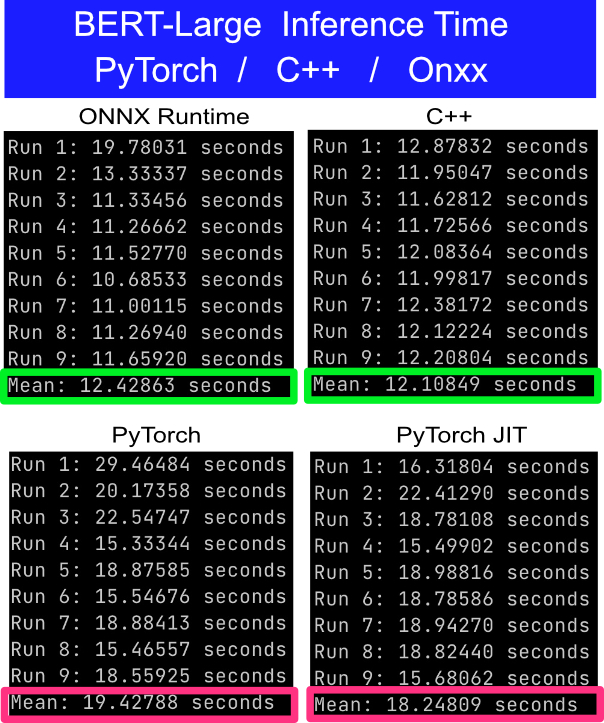

# Deploying Deep Learning Models in C++: BERT Language Model

This repository show the code to deploy a deep learning model serialized and running in C++ backend.

For the sake of comparison, the same model was loaded using PyTorch JIT and ONNX Runtime.

The C++ server can be used as a code template to deploy another models.

## Results
The test consist of make 100 async calls to the server. The client measure the time taken to get the response of the 100 requests. To reduce variability it is performed 10x, i.e, 1000 requests.
- The results was obtained in a Macbook Pro with a i7 6C-12T CPU. 
- The CPU fans was set the max to reduce any possible thermal-throttling.
- Before start each test the temps was lowered down around 50 C.

## Model Details

- <b>Model</b>: BERT Large uncased pretrained from [hugginface](http://huggingface.co).
- <b>Input</b>: Text with [MASK] token to be predicted
- <b>Output</b>: Tensor in shape (seq_len, 30522)

## Python server details
FastAPI web-app server running by hypercorn with 6 workers (adjust this by the number of threads you have).
- [server-python/app_pt.py](server-python/app_pt.py): Load the model using PyTorch load_model(), the standard way of load a PyTorch model.
- [server-python/app_jit.py](server-python/app_jit.py): Load the serialized model using PyTorch JIT runtime.
- [server-python/app_onnx.py](server-python/app_onnx.py): Load the serialized model using ONNX runtime.

## C++ server details
To deploy the model in C++ it was used the same serialized model used in JIT runtime. The model is loaded using [libtorch C++ API](https://pytorch.org/cppdocs/installing.html). To deploy as a http-server, it is used [crow](https://github.com/ipkn/crow). The server is started in multithreaded mode.

- [server-cpp/server.cpp](server-cpp/bert-server.cpp): Code to generate the c++ application that load the model and start the http server on port 8000.

Deploy a model in C++ is not as straightforward as it is in Python. Check the [libs](server-cpp/libs) folder for more details about the codes used.

## Client details
Client uses async and multi-thread to perform as many requests as possible in parallel. See the [test_api.py](test_api.py)

## TO-DO
- Experiment on CUDA device.
- Experiment another models like BERT.
- Exprimento quantized models.

## References
- [hugginface](http://huggingface.co)
- [PyTorch Tutorials](https://pytorch.org/tutorials/advanced/super_resolution_with_onnxruntime.html)
- [PyTorch C++](https://pytorch.org/tutorials/advanced/cpp_frontend.html)
- [Crow C++ microframework for web](https://github.com/ipkn/crow)
- [Serving PyTorch Models in C++](https://github.com/Wizaron/pytorch-cpp-inference)
- [Deep Learning in Production](https://github.com/ahkarami/Deep-Learning-in-Production)
- [Book: Hands-On Machine Learning with C++: Build, train, and deploy end-to-end machine learning and deep learning pipelines](https://www.amazon.com.br/Hands-Machine-Learning-end-end-ebook/dp/B0881XCLY8)